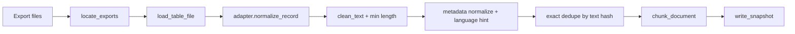

# Offline build pipeline

End-to-end flow implemented in `app/offline_build/pipeline.py`:

## Steps

1. **Import** — Scan `--input-dir` for supported `*.json` / `*.csv` files; load rows (see `import_datahub/loader.py`).
2. **Normalize** — Map each row to `NormalizedDocument`; strip boilerplate, collapse whitespace (`normalize/text_cleaner.py`); drop rows shorter than the configured minimum.
3. **Dedupe** — Keep first document per SHA-256 hash of `clean_text` (`dedupe/exact.py`). Near-duplicate detection is stubbed (`dedupe/near_dup.py`).
4. **Classify** — Rule-based `source_type`, `evidence_type`, and keyword `topic_tags` (`classify/`). Applied when building evidence chunks.
5. **Chunk** — Split `clean_text` into overlapping character windows (`chunk/evidence_chunker.py`).
6. **Snapshot** — Write `manifest.json`, `build_report.json`, and JSONL catalogs (`build_snapshot/writer.py`).

### Phase 2 (knowledge layer)

When `--pedagogy-dir` and/or `--topic-card-dir` is set:

7. **Pedagogy** — Read optional JSONL files (`rules.jsonl`, `rubric.jsonl`, `language_bank.jsonl`, `coaching_tips.jsonl`) → `pedagogy_items.jsonl`.
8. **Topic cards** — Load manual YAML/JSON; merge with bootstrap cards from frequent `topic_tags` → `topic_cards.jsonl`.
9. **Evidence index** — Derive `evidence_index.jsonl` from chunks + docs (stance, credibility, citation).

`manifest.schema_version` becomes `1.1` and additional counts are recorded.

## CLI

- `python main.py build-offline --input-dir <dir> --snapshot-id <id>`
- `python main.py build-offline --input-dir <dir> --pedagogy-dir <dir> --topic-card-dir <dir> --snapshot-id <id>`
- `python main.py build-knowledge ...` (requires at least one of `--pedagogy-dir` / `--topic-card-dir`)
- `python main.py validate-snapshot --snapshot-dir <snapshot_path>`
